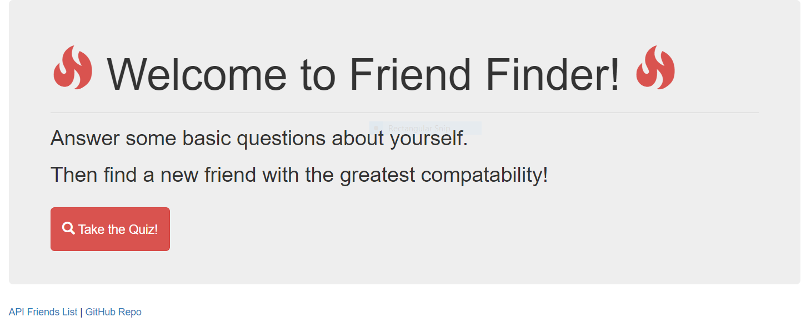
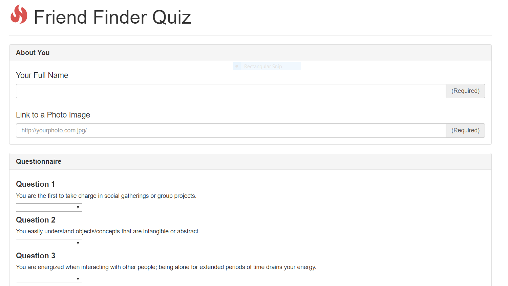

# FreindFinder
https://young-dusk-91673.herokuapp.com/

This app will connect you with a friend that is compatible with you, based on your answers to the survey.  
 

 
 * When the page first loads it will diplay the title screen that asks the user if they would like to take a survery.
  
 * Users can also view the github repo to view the opsen source code as well as the JSON API file.
   
 
  
 * If the user choses to take the survey they will be directed to answer 10 questions.  
  
 * This will determine how compatible they are with other users.  
  
 * There Name, Photo Link and answers will be added to the API friends list. This will give the app the ability to widen the search for the most compatible firend for the user.
  
  
 <h2>Technologies Used</h2>
  
 * NodeJS
  
 * NPM Packages
 <ul>
 <li>body-parser</li>
 <li>express</li>
 <li>path</li>
 </ul>

 
<h2>Built With</h2>
* Bootstrap
  
 * JavaScript
  
 * HTML
  

 <h2>Author</h2>
 * CJ Summers 

